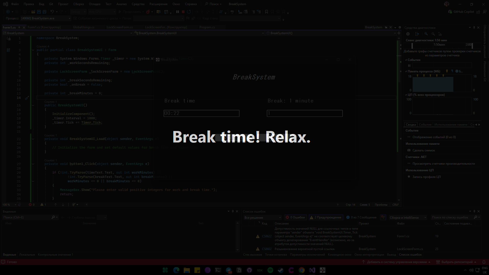

#  BreakSystem

**BreakSystem** is a minimalistic productivity tool that helps you follow the **work/break routine** by locking your screen during break times.

Inspired by the Pomodoro technique, it allows you to focus during work sessions and forces you to rest — by making the app the only usable window on the screen during the break.

NOTE: for skip break. use alt + f4
---

## 🚀 Features

- ⏱️ Work timer and break timer cycle
- 🔒 Fullscreen lock screen during breaks
- 🔁 Automatic switching between work and break
- 🪶 Lightweight, no installation of .NET required
- 🪟 Built with Windows Forms (.NET 8)

---

## 📥 Download

👉 [**Download latest installer (.exe)**](https://github.com/fxhxyz4/BreakSystem/releases/latest)

No need for .NET Runtime — it's fully self-contained.

---

## 🖼️ Screenshots



---

## 🧑‍💻 How to Use

1. Enter **work duration** (minutes)
2. Enter **break duration** (minutes)
3. Press **Start**
4. When break starts — screen locks
5. When break ends — you're back to work
6. Press **Stop** to reset at any time

---

## 🔧 How to Build

> Prerequisites:
> - [.NET SDK 8.0+](https://dotnet.microsoft.com/download)
> - Visual Studio 2022+ (with WinForms support)

```bash
git clone https://github.com/fxhxyz4/BreakSystem.git
cd BreakSystem
dotnet build -c Release
dotnet publish -c Release -r win-x64 --self-contained true /p:PublishSingleFile=true
```

---

## 🧳 Installer (optional)
The installer is created with Inno Setup.

You can find the compiled .exe installer in the Releases tab.

---

## ⚖️ License
MIT License.
Free to use, modify and distribute.
